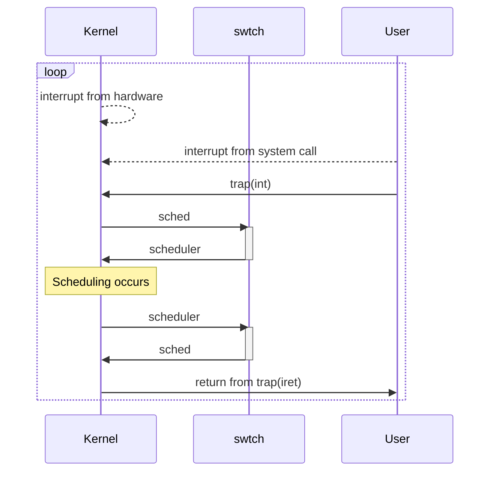
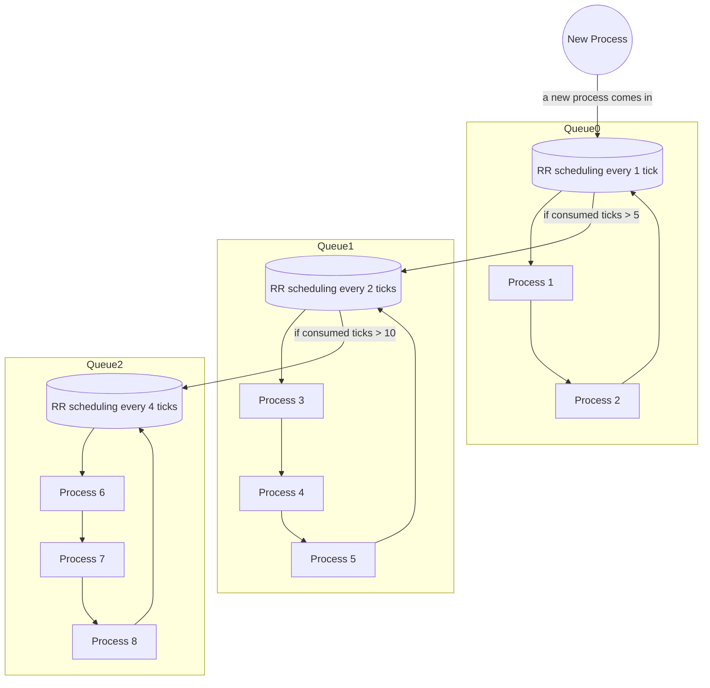
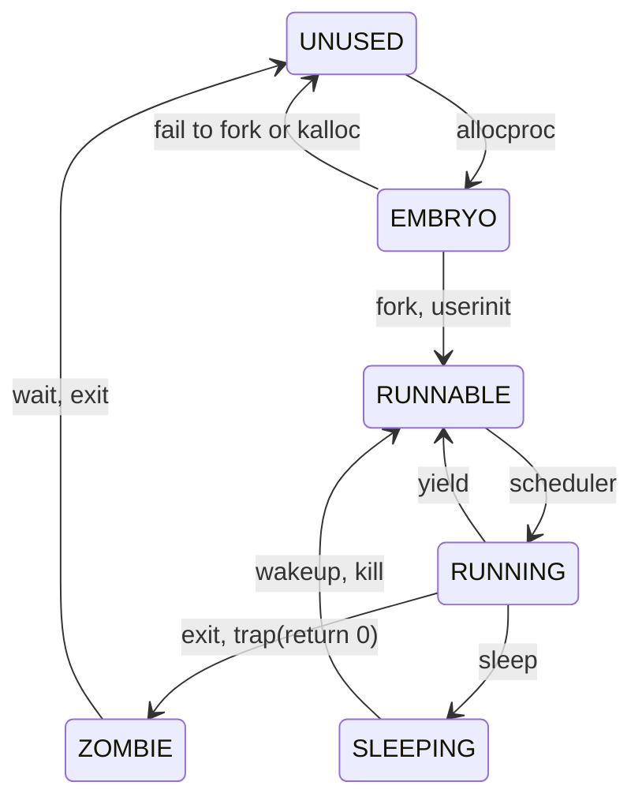

# Scheduler Design in xv6

## 1. Key Objectives of a CPU Scheduler
- short turnaround time for short tasks
- short response time for recent tasks
- fairness to processes as a resource manager

## 2. Design a CPU scheduler
> As cpu resources cannot be divided into physical areas such as memories, cpu schedulers use the slice of cpu time, called **time quantum**.  
> Also, to get the control back to the kernel against long running processes, most OSs utilize timer interrupts to periodically regain controls over processes.



In summary, designing cpu scheduling is to make a good algorithm that determines which process to deserve a next time quantum whenever a timer interrupt occurs.

### [As is] Current xv6 scheduler

#### RR(Round Robin)
> Round Robin scheduling in the xv6 switches the currently running process over to the next runnable process every tick.

Although RR provides powerful responsiveness, it lacks with considerations about turnaround time.

### [To be] MLFQ Scheduler combined with Stride scheduling
To compensate for the deficits of RR scheduling, combine MLFQ scheduling with stride scheduling to achieve our key objectives.

### [Prototyping] [Python Scheduling Simulator](/docs/Scheduler-Simulation.ipynb)

Before I delve into implementing my scheduler design, I made a [python prototype code](/docs/Scheduler-Simulation.ipynb) to check my scheduling algorithm that it correctly works by visualizing process selections of the scheduler, in order to minimize the discrepancy between the expected outcomes and my naive design.

<details markdown="1">
<summary>Fold/Unfold the descriptions about python scheduling simulations</summary>

By using python keyword `yield`, it is possible to mimic the behaviors of the context switching of a scheduler.

1. MLFQ
```python
BOOSTING_TICKS = 100
MLFQ_MAX_TICKS = [
  1, 2, 4
]
MLFQ_TIME_ALLOTS = [
  5, 10, 10 ** 8
]
```
- 1. Process0, Process1, Process2, Process3, Process4 appears at tick 0
- 2. Process5 appears at tick 80
(In this case, higher priority is 2, lower priority is 0)

In these MLFQ settings,

  1. the cumulated process ticks are shown below

  

Since Process5 appears at tick 80, it has the highest priority at the time.

  2. the level of processes are shown below

  

Since the priority boosting occurs at every 100 ticks, every process comes up to at level 2.

2. Stride (zero-initialized pass)

- 1. Process0(10%), Process1(20%), Process2(30%), Process3(20%), Process4(20%) appears at tick 0
- 2. Process3 change its share from 20% to 5% at tick 50
- 3. Process5(30%) appears at tick 100
(Initialize the pass value with zero value)

In these stride setting,

  1. the cumulated process' passes are shown below

  

It can be gamed by a new process(Process5) because its pass value is initialized with zero and to compensate the pass against passes of other processes, it overoccupies the share of the stride queue for some moment!

  2. process selection scatter plot is shown below

  

A new process appearing at tick 100 is long-running.

3. Stride (max-pass-initialized pass) **(My design)**

- 1. Process0(10%), Process1(20%), Process2(30%), Process3(20%), Process4(20%) appears at tick 0
- 2. Process3 change its share from 20% to 5% at tick 50
- 3. Process5(30%) appears at tick 100
(Initialize the pass value with maximum pass value)

In these stride setting,

  1. the cumulated process' passes are shown below

  

Since initializing a pass value of a process with the maximum pass value makes the stride queue robust to a new process, the graph shows fairly great results.

  2. process selection scatter plot is shown below

  

The fact that **Process3** changes its share from 20% to 5% at tick 50 implies that the frequency of cpu time given to Process3 will be smaller and the results clearly shows a dynamic change of execution frequency of **Process3**.
</details>

#### A) MLFQ(Multi Level Feedback Queue)
> MLFQ is well known for a scheduling algorithm that satisfies some critical requirements such as a short turnaround time and a short response time by learning from the past behaviors of the currently running processes.

<details markdown="1">
<summary>Fold/Unfold the state diagram of MLFQ</summary>



</details>

- 3-level feed back queue
  - Q0 -> Q1 -> Q2
  - if Q0 is empty, find a process in Q1. Otherwise, round robin the Q0 and lower the priority of processes until its time allotment depletes.
  - if Q1 is empty, find a process in Q2. Otherwise, round robin the Q1 and lower the priority of processes until its time allotment depletes.
  - Round-robin the Q2 until new process comes in or the periodic priority boost occurs.
- Each level of queue adopts a Round Robin policy with different time quantum
  - Q0: 1 tick
  - Q1: 2 ticks
  - Q2: 4 ticks
- Each queue has a different time allotment
  - Q0: 5 ticks
  - Q1: 10 ticks
- To prevent starvation, priority boost is required
  - every 100 ticks
- To achieve the purpose of MLFQ, every tick in MLFQ is measured by a local tick count of MLFQ
  - `uint mlfq_ticks;`
- To test various scheduling scenarios and check the behaviors of MLFQ, some system calls are requried to implement.
  - `int yield(void)`: to try to game a xv6 cpu scheduler, this makes an option to voluntarily give up cpu resource.
  - `int getlev(void)`: to check at which level it is running in MLFQ, this can help us too.

<details markdown="1">
<summary>Implementation Details</summary>

- Implementation Details
  1. Metadata for MLFQ
    - To implement MLFQ in xv6, add extra metadata fields into `struct proc`
      - Add a consumed tick counts(**cticks**) field of a process into `struct proc`
      - Add a level(**lev**) field into `struct proc`
      - To save the size of proc struct, use lev for 28 bits and yield_by for 4 bits
      ```c
      struct proc { // in proc.h
          ...
          uint cticks;                 // a consumed tick count at the given level of the queue
          uint yield_by :  4;          // if the process is yielded by stride = 1, mlfq = 2
          uint lev      : 28;          // Level in MLFQ(0~NMLFQ), otherwise Stride Level
          ...
      };
      ```

  2. Then, an implementation of `int getlev(void)` can become much simpler.
    ```c
    int get_lev(void){
        struct proc *p = myproc();
        acquire(&ptable.lock);
        uint lev = p->lev;          // Fetch the priority level of MLFQ
        release(&ptable.lock);
        if(0 <= lev && lev < NMLFQ) // Check whether it is in MLFQ
          return lev;
        return -1;
    }
    ```

  3. To manage the time allotment and time quantum for MLFQ, set some functions(****_has_to_yield) when the timer interrupt occurs
    ```c
    void
    trap(struct trapframe *tf) // in trap.c
    {
        ...

        // Force process to give up CPU on clock tick.
        // If interrupts were on while locks held, would need to check nlock.
        if(myproc() && myproc()->state == RUNNING &&
            tf->trapno == T_IRQ0+IRQ_TIMER) {
            if(stride_has_to_yield(myproc()) || // If the stride scheduler needs to yield, yield.
            (is_mlfq(myproc()) && mlfq_has_to_yield(myproc()))) { // if the MLFQ needs to yield, yield.
            yield();
          }
        }

        ...
    }
    ```
    - Provide an interface call(`mlfq_has_to_yield`) that notifies whether the MLFQ has to yield at the current tick.
      - To increase the process's tick counter(cticks)
      - To lower the priority if the process exhausts its tick allotment
      - To yield if the current process exhausts its time quantum
      - Increase `mlfq_tick` counts together with the lock(`mlfq_lock`)

    ```c
    int
    mlfq_has_to_yield(struct proc *p)
    {
      static int mlfq_ticks_elapsed; // internal counter for mlfq

      const uint MLFQ_MAX_TICK_OF_CURRENT_PROC = MLFQ_MAX_TICKS[getlev()];

      if(mlfq_ticks_elapsed >= MLFQ_MAX_TICK_OF_CURRENT_PROC) {
        mlfq_ticks_elapsed = 0;
      }
      mlfq_ticks_elapsed++; // Increase the time quantom for this queue

      acquire(&mlfqlock);
      mlfq_ticks += 1; // Increase the MLFQ tick count
      release(&mlfqlock);

      acquire(&ptable.lock);
      p->cticks += 1; // Increase the process's tick count
      if(mlfq_ticks_elapsed >= MLFQ_MAX_TICK_OF_CURRENT_PROC)
        p->yield_by = 2;
      release(&ptable.lock);

      return mlfq_ticks_elapsed >= MLFQ_MAX_TICK_OF_CURRENT_PROC;
    }
    ```
</details>

#### B) Stride Scheduling
> Stride Scheduling is amazingly powerful to ensure the fairness due to its deterministic characteristics compared to lottery scheduling. If a small set of tasks are scheduled, that deterministic behaviors can show better performance than those nondeterministic.

<details markdown="1">
<summary>Fold/Unfold the diagram of Stride scheduling</summary>


</details>

- In the stride scheduling, a process can request OS how much it wants to share the cpu by calling a system call.
  - With my design, that system call is `int set_cpu_share(int)`.
  - Say that a process wants to hold 40% of the cpu share, calling `set_cpu_share(40)` is enough.

- To ensure that MLFQ should always occupy at least 20% of the CPU share, I set the ratio of MLFQ to **22/102**, not 20/100.
  ```c
     // stride_scheduler.h
     #define STRIDE_MLFQ_SHARE 22
     #define STRIDE_MAX_SHARE 102
  ```
  - Since there must be some errors to perform the fair scheduling in real world applications, I rather set the ratio of MLFQ a little bit larger than 20% to handle this problem.
  - [Implementation Detail](xv6-public/stride_scheduler.h#L8)

<details markdown="1">
<summary>Implementation Details</summary>

- Implementation Details
  - Use a priority queue that can
    - add a node with a priority value
    - remove a specific node by `struct proc*`
    - modify a priority value in that queue
    - check emptiness and the size
    - check whether a given process(`struct proc*`) is in the queue
  - Metadata for Stride
    - Make a fraction structure(`struct frac`)
    ```c
    struct frac { // fraction structure
      uint num;
      uint denom;
    };
    ```
    - Make a `struct StrideItem` to store passes and shares of a given process and MLFQ
    ```c
    struct StrideItem { // in stride_scheduler.h
      frac pass;       // pass for Stride
      uint isMLFQ : 1; // if mlfq = 1, o.w. = 0
      int share   : 31;// stride for Stride
      void *proc;      // pointer to struct proc
    };
    ```

  - Pseudo Code
    - Existing Process in MLFQ wants to register: set_cpu_share()
    ```c
    int set_cpu_share(int share){
        ...
        acquire(&ptable.lock);
        if(is_mlfq(p)) { // where p is current process
          // Initialize the stride item
          p->lev = STRIDE_PROC_LEVEL;
          p->cticks = 0;
          stride_item_init(&stride_item, share, p, 0);
          
          ret = stride_push(&stride_item)); // Push it to the Stride queue

          release(&ptable.lock); // Release the ptable lock for yield
          yield(); // Yield the cpu for rescheduling
          return ret;
        } else if(is_stride(p)) {
          // Find the stride item and adjust the share value
          ret = stride_adjust(stride_find_item(p), share);
        } else {
          ret = -1;
        }
        release(&ptable.lock);
        return ret;
    }
    ```

    - Process Exchange: scheduler()
    ```c
    void stride_scheduler(struct cpu *c){
        next_process = stride_top();                         // Fetch a Runnable process

        if(next_process->isMLFQ){
          // Do MLFQ
          mlfq_scheduler(c);
        }else{
          if(next_process->state != RUNNABLE)
            goto stride_pass;
          swtch(&(c->scheduler), p->context);       // Context Switch
        }
      stride_pass:
        next_process = SQ.pop();                    // Pop a RUNNABLE process with the minimum priority value (pass)
        ...
        next_process->state = RUNNING;              // Change its process state to RUNNING
        swtch(&(cpu->scheduler), next_process);     // Switch to another stack and then return
        ...
        next_process->pass += next_process->stride; // Increment pass value by its stride
        stride->max_pass = max(stride->max_pass, next_process->pass) // Update the max pass
        if(next_process->isMLFQ || next_process->state != ZOMBIE)    // Push mlfq always and non-zombie processes
          SQ.push(&next_process);                   // Put it back with modfied priority value (pass)
    }
    ```

    - checks whether the stride queue has to yield or not and increase `stride_ticks` counts together
    ```c
    int
    stride_has_to_yield(struct proc *p)
    {
      static uint stride_ticks_elapsed; // internal counter for stride

      if(stride_ticks_elapsed >= STRIDE_MAX_TICKS)
        stride_ticks_elapsed = 0;

      acquire(&stride_lock);
      stride_ticks += 1; // Increase the Stride tick count
      release(&stride_lock);

      stride_ticks_elapsed++; // Increase the time quantom the current process can use

      acquire(&ptable.lock);
      p->cticks += 1; // Increase the process's tick count
      if(stride_ticks_elapsed >= STRIDE_MAX_TICKS)
        p->yield_by = 1; // Mark this field to 1 for Stride Scheduler to switch up
      release(&ptable.lock);

      return stride_ticks_elapsed >= STRIDE_MAX_TICKS;
    }
    ```
</details>

#### C) Combine the stride scheduling algorithm with MLFQ

To combine the stride scheduling algorithm with MLFQ, regard MLFQ as a scheduling item in the stride scheduling that has at least 20% share.

#### D) xv6 Process State Transition Diagram

To make the most of xv6, our scheduler must have to recognize the state of each process for managing its data structures correctly.



To handle the process management in each scheduling,
 - Inserted the process insertion code at `fork` and `userinit` in proc.c
 - Inserted the process removal code at `scheduler` in proc.c

## 3. Required System Calls

### 3-1. yield: yield the cpu to the next process
- Wrapper: `int sys_yield(void)`
- System Call: `int yield(void)`
- Return Value: 0

### 3-2. getlev: get the level of the current process in the MLFQ.
- Wrapper: `int sys_getlev(void)`
- System Call: `int getlev(void)`
- Return Value: the level(0, 1, 2) of MLFQ queue where the currently running process stays, otherwise a negative number

### 3-3. set_cpu_share: inquires to obtain a cpu share
- Wrapper: `int sys_set_cpu_share(void)`
- System Call: `int set_cpu_share(int)`
- Return Value: 0 if successful, otherwise a negative number

## 4. Verify the scheduler
### [10 Scheduling Scenarios](scheduling-scenarios-analysis)

- The workloads were tested 5 times each on Ubuntu 20.04 in ssh
- To testify the scheduler properly, at least 5 processes were used
- The charts and data were plotted from [matplotlib.pyplot](/docs/project1/parse.ipynb)
- To save the page, the analysis can be found [here](scheduling-scenarios-analysis)

## 5. Coding Conventions

To follow the xv6's coding convention, use [**clang-format**](xv6-public/.clang-format) to automatically ensure the coding convention already used in xv6 frictionlessly.

## 6. Terminology

- Tick: The time interval between consecutive timer interrupts is called a tick.
  - The default value set for the tick in xv6 is about 10ms.

## 7. Requirements to satisfy

- [x] The total sum of CPU share requested from the processes in the stride queue cannot exceed 80% of the total CPU time.
- [x] Exception handling needs to be properly implemented to handle oversubscribed requests.
- [x] Do not allocate CPU share if the request induces surpass of the CPU share limit.
- [x] Make a system call (i.e. set_cpu_share) that requests a portion of CPU and guarantees the calling process to be allocated that much of a CPU time.
- [x] The rest of the CPU time(20%) should run for the MLFQ scheduling which is the default scheduling policy in this project
- [x] The total amount of stride processes are able to get at most 80% of the CPU time.
Exception handling is required for exceeding requests.