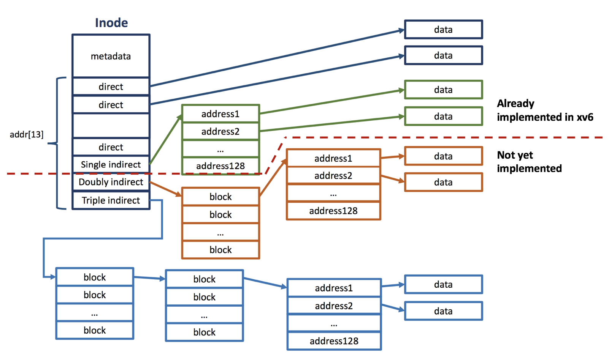
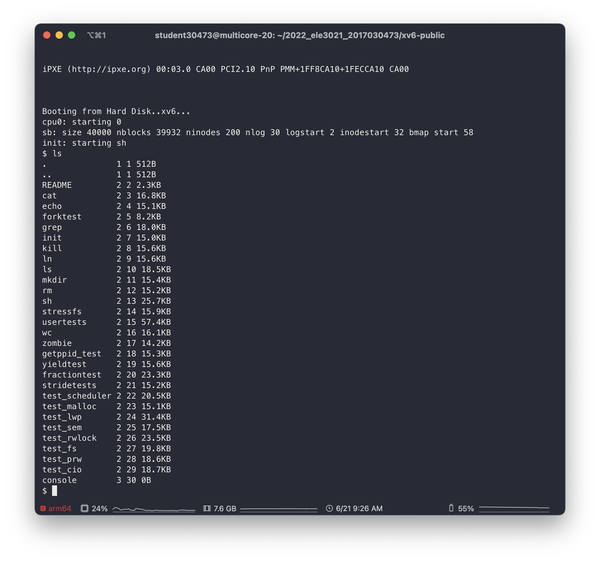
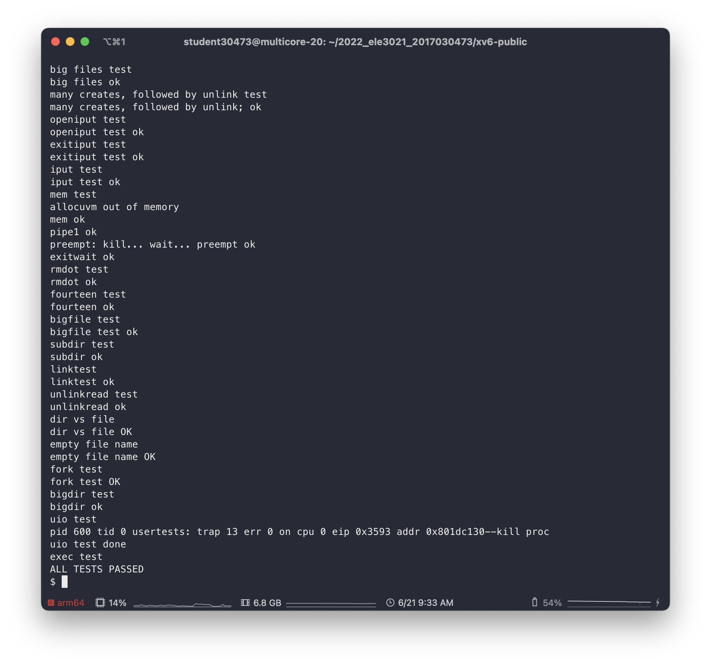

# Implement xv6 Concurrent Large File System

## 1. Expand the maximum size of a file in xv6

### 1. Expand a file size in xv6 by implementing doubly indirect node and triple indirect node in inode



#### Design of Changes in xv6 File System

To expand a file size in xv6, it is essential to effectively manage disk blocks in our file system.
- Change `static uint bmap(struct inode *ip, uint bn)` in fs.c to support expansion of a file in larger file system
- Change `static void itrunc(struct inode *ip)` in fs.c to support shrink of a file in larger file system
- Define `NDINDIRECT` as `(NINDIRECT * NINDIRECT)`,and `NTINDIRECT` as `(NINDIRECT * NDINDIRECT)`
- Change `NDIRECT` in file.h from 12 to 10, `MAXFILE` to `(NDIRECT + NINDIRECT + NDINDIRECT + NTINDIRECT)`, and addrs from `addrs[NDIRECT+1]` to `addrs[NDIRECT+3]`

#### Key Implementation of Expanded File System

- To implement the expansion of a file,
  - I add a logic on [`static uint bmap(struct inode *ip, uint bn)`](xv6-public/fs.c#L373) to use a triple indirect node.
- To implement the deletion(or truncation) of a file,
  - I add a helper function [`static void btrunc(uint dev, uint blockno, uint level)`](master/xv6-public/fs.c#L469) to recursively truncate the blocks of the given file. 

#### Test Policy (test_fs)
  - [x] [Create test](xv6-public/test_fs.c#L104) - Create a large file
    + write 1 * 1024 = 1 Kibytes file
    + write 4 * 1024 = 4 Kibytes file
    + write 15 * 1024 = 15 Kibytes file
    + write 16 * 1024^2 = 16 Mibytes file
  - [x] [Read test](xv6-public/test_fs.c#L116) - Read a large file correctly
    + read the generated file from **Create Test** and verify the data written correctly
  - [x] [Stress test](xv6-public/test_fs.c#L134) - Stress test (Deletion correctness)
    + Create and Remove the file 4 times.
    + The total writing size is 16 * 1024 * 1024 * 4 = 64 Mbytes

## 2. Implement Thread-safe `pread` and `pwrite` User Library

### 1. Implement the `pread`, `pwrite` system call
> pread and pwrite system call additionally gets the offset parameter to indicate the data offset of the file.

#### Design of pwrite and pread

- `int pwrite(int fd, void* addr, int n, int off)`
  + int fd: a file descriptor for write
  + void* addr: address to the content to be written
  + int n: a size of bytes to write
  + int off: an offset to where to write
> pwrite is a write call that does not modify the file offset

- `int pread(int fd, void* addr, int n, int off)`
  + int fd: a file descriptor for read
  + void* addr: address to the content to be read
  + int n: a size of bytes to read
  + int off: an offset to where to read
> pread is a read call that does not modify the file offset

To implement pwrite and pread, it is useful to skim the implementation of write and read syscalls.

#### Key Implementation of pwrite and pread

- To implement pwrite and pread,
  - I reference [filewrite](xv6-public/file.c#L118) and [fileread](xv6-public/file.c#L97) functions in [file.c](xv6-public/file.c)
  - Then, add new functions [pfilewrite](xv6-public/file.c#L181) and [pfileread](xv6-public/file.c#L181)
    - from which the behavior that modifies the file offset from filewrite and fileread are removed

#### Test Policy (test_prw)

  - [x] [Read Test](xv6-public/test_prw.c#L61) - Pread works correctly
    - Write some data using `write` and then read the file in inverse order
  - [x] [Write Test](xv6-public/test_prw.c#L91) - Pwrite works correctly
    - Write the file in inverse order and checks whether the content is correctly written by `read`

### 2. Implement a thread-safe read and write user library

#### Design of thread-safe read/write user library

- `typedef struct ts_guard thread_safe_guard;`
  - This declaration will be included in `types.h`
  - This struct must have rwlock (what I've implemented in Project3) and a file descriptor
- `thread_safe_guard * thread_safe_guard_init(int fd);`
  - int fd: a file descriptor to read and write
  - Returns a thread_safe_guard object to thread-safely read/write
- `int thread_safe_pread(thread_safe_guard* file_guard, void* addr, int n, int off)`
  - thread_safe_guard* file_guard: a pointer to thread_safe_guard object
  - void* addr: the address of the memory from which to read the file
  - int n: the number of bytes of data to read
  - int off: the location of the data to be read within the file
- `int thread_safe_pwrite(thread_safe_guard* file_guard, void* addr, int n, int off)`
  - thread_safe_guard* file_guard: a pointer to thread_safe_guard object
  - void* addr: the address of the memory from which to write the file
  - int n: the number of bytes of data to write
  - int off: the location of the data to be write within the file
- `void thread_safe_guard_destroy(thread_safe_guard * file_guard);`
  - Releases the given `file_guard` thread_safe_guard object

#### Key Implementation of thread-safe pwrite and pread

Just wrap pread and pwrite up with readers-writer lock

```c
int
thread_safe_pread(thread_safe_guard *file_guard, void *addr, int n, int off)
{
  int result;
  rwlock_acquire_readlock(&file_guard->lock);
  result = pread(file_guard->fd, addr, n, off);
  rwlock_release_readlock(&file_guard->lock);
  return result;
}
```

```c
int
thread_safe_pwrite(thread_safe_guard *file_guard, void *addr, int n, int off)
{
  int result;
  rwlock_acquire_writelock(&file_guard->lock);
  result = pwrite(file_guard->fd, addr, n, off);
  rwlock_release_writelock(&file_guard->lock);
  return result;
}
```

#### Test Policy (test_cio)
- [x] [Concurrent Read Test](xv6-public/test_cio.c#L63) - Thread-safe pread works correctly
- [x] [Concurrent Write Test](xv6-public/test_cio.c#L87) - Thread-safe pwrite works correctly
> Test Scenario  
> Multiple threads are reading a file, while a few number of threads are writing to the file.  
> Then, checks whether there is a data race.

## 3. Miscellaneous Features

- Human-readable Size Format Support in `ls`


## 4. Final Test

- XV6 usertests

> xv6 usertests were successfully ran