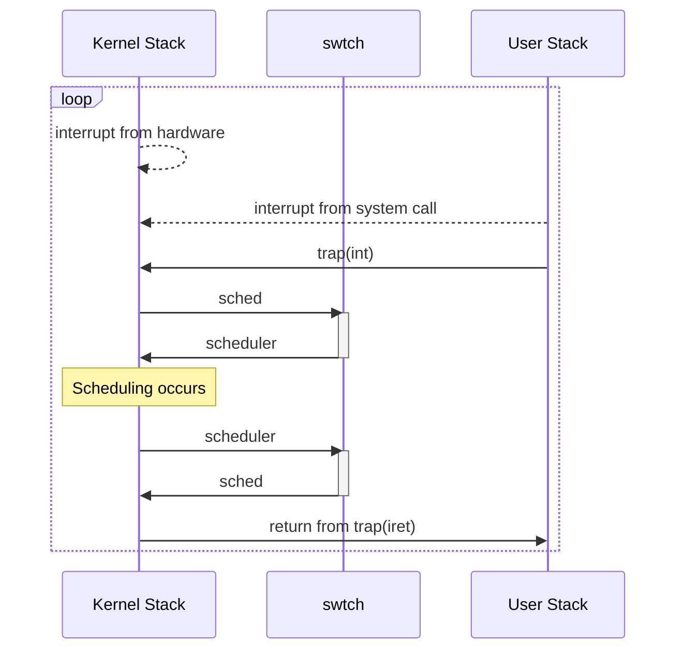
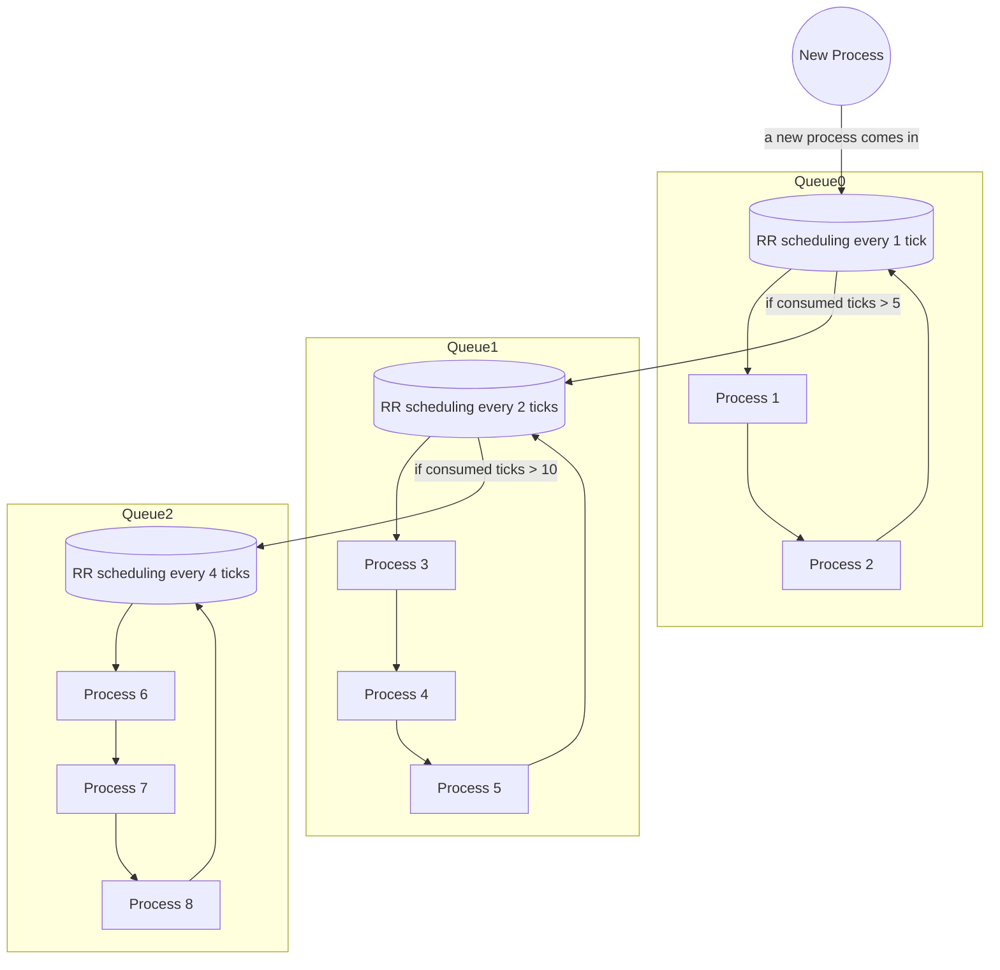
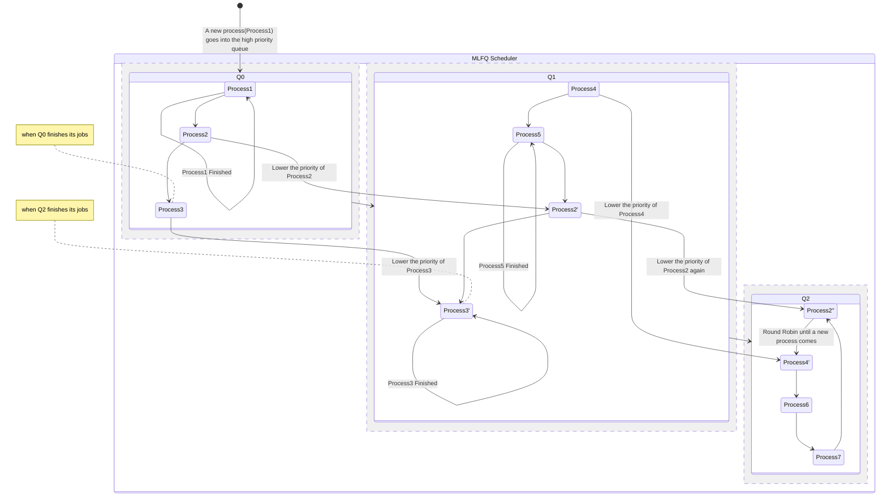
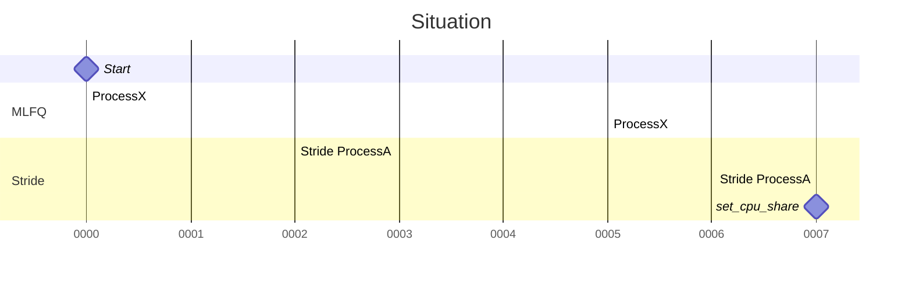
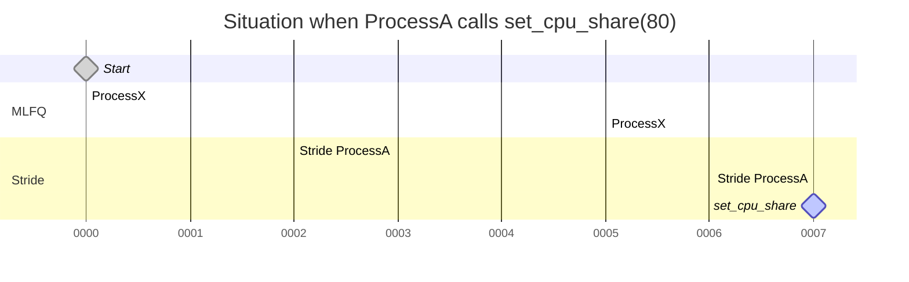
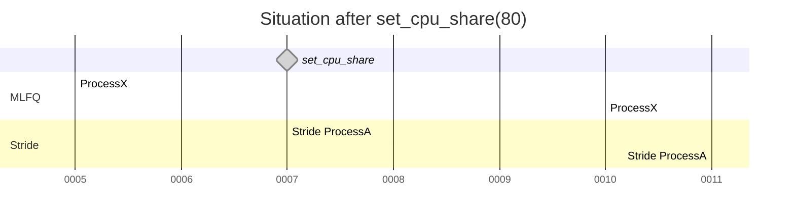
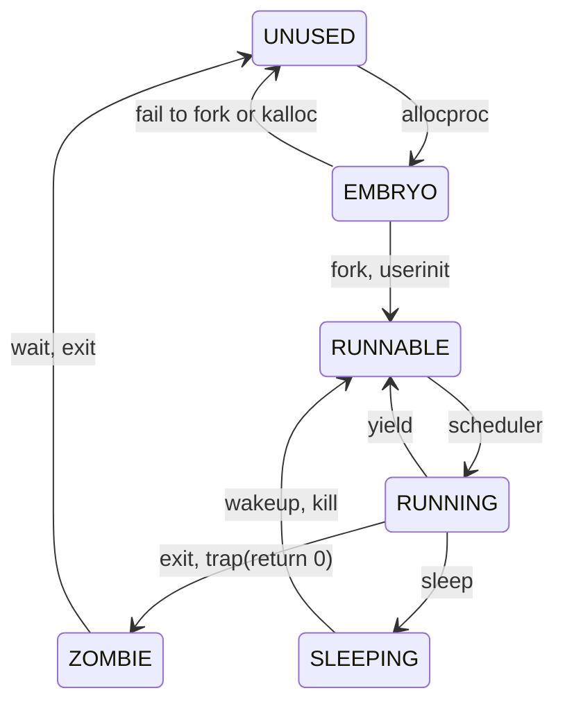

# Context Switching in xv6

```mermaid
sequenceDiagram
    participant K as Kernel Stack
    participant M as swtch
    participant U as User Stack
    loop
        %% interrupts occur
        K-->>K : interrupt from hardware
        U-->>K : interrupt from system call
        U->>K : trap(int)
        K->>M : sched
        activate M
        M->>K : scheduler
        deactivate M
        Note over K: Scheduling occurs
        K->>M : scheduler
        activate M
        M->>K : sched
        deactivate M
        K->>U : return from trap(iret)
    end
```

```mermaid
flowchart TB
    %% Queues
    Q0[(RR scheduling every 1 tick)]
    Q1[(RR scheduling every 2 ticks)]
    Q2[(RR scheduling every 4 ticks)]
    
    %% processes
    new_proc((New Process))
    proc1[Process 1]
    proc2[Process 2]
    proc3[Process 3]
    proc4[Process 4]
    proc5[Process 5]
    proc6[Process 6]
    proc7[Process 7]
    proc8[Process 8]
    subgraph Queue0
        direction LR
        Q0
        proc1
        proc2

        Q0 --> proc1
        proc1 --> proc2
        proc2 --> Q0
    end
    subgraph Queue1
        direction LR
        Q1
        proc3
        proc4
        proc5

        Q1 --> proc3
        proc3 --> proc4
        proc4 --> proc5
        proc5 --> Q1
    end
    subgraph Queue2
        direction LR
        Q2
        proc6
        proc7
        proc8

        Q2 --> proc6
        proc6 --> proc7
        proc7 --> proc8
        proc8 --> Q2
    end

    new_proc -- a new process comes in --> Q0
    Q0 -- if consumed ticks > 5 --> Q1
    Q1 -- if consumed ticks > 10 --> Q2
```

```mermaid
stateDiagram-v2
    [*] --> Q0 : A new process(Process1) goes into the high priority queue
    MLFQ_Scheduler : MLFQ Scheduler
    state MLFQ_Scheduler {
        state Q0 {
            direction LR
            Process1 --> Process2
            Process2 --> Process3
            Process1 --> Process1 : Process1 Finished
            Process2 --> Process2' : Lower the priority of Process2
            Process3 --> Process3' : Lower the priority of Process3
            note left of Process3
                when Q0 finishes its jobs
            end note
        }
        Q0 --> Q1
        --
        state Q1 {
            direction LR
            Process4 --> Process5
            Process5 --> Process5 : Process5 Finished
            Process5 --> Process2'
            Process2' --> Process3'
            Process4 --> Process4' : Lower the priority of Process4
            Process2' --> Process2'' : Lower the priority of Process2 again
            Process3' --> Process3' : Process3 Finished
            note left of Process3'
                when Q2 finishes its jobs
            end note
        }
        Q1 --> Q2
        --
        state Q2 {
            direction LR
            Process4' --> Process6
            Process6 --> Process7
            Process7 --> Process2''
            Process2'' --> Process4' : Round Robin until a new process comes
        }
    }
```

```mermaid
gantt
    dateFormat  YYYY
    axisFormat  %Y
    title       Situation

    Start : milestone, 0000, 0000
    
    section MLFQ
    ProcessX : 0000, 0002
    ProcessX : 0005, 0007

    section Stride
    Stride ProcessA : 0002, 0005
    Stride ProcessA : 0007, 0010

    set_cpu_share : milestone, 0007, 0010
```

```mermaid
gantt
    dateFormat  YYYY
    axisFormat  %Y
    title       Situation when ProcessA calls set_cpu_share(80)

    Start :done, milestone, 0000, 0000
    
    section MLFQ
    ProcessX : 0000, 0002
    ProcessX : 0005, 0007

    section Stride
    Stride ProcessA : 0002, 0005
    Stride ProcessA : 0007, 0010

    set_cpu_share :active, milestone, 0007, 0010
```

```mermaid
gantt
    dateFormat  YYYY
    axisFormat  %Y
    title       Situation after set_cpu_share(80)
    
    set_cpu_share :done, milestone, 0007, 0010

    section MLFQ
    ProcessX : 0005, 0007
    ProcessX : 0010, 0011

    section Stride
    Stride ProcessA : 0007, 0010
    Stride ProcessA : 0011, 0015

```

```mermaid
stateDiagram
    UNUSED --> EMBRYO    : allocproc
    EMBRYO --> UNUSED    : fail to fork or kalloc
    EMBRYO --> RUNNABLE  : fork, userinit
    RUNNABLE --> RUNNING : scheduler
    RUNNING --> RUNNABLE : yield
    RUNNING --> ZOMBIE   : exit, trap(return 0)
    RUNNING --> SLEEPING : sleep
    SLEEPING --> RUNNABLE: wakeup, kill
    ZOMBIE --> UNUSED    : wait, exit
```