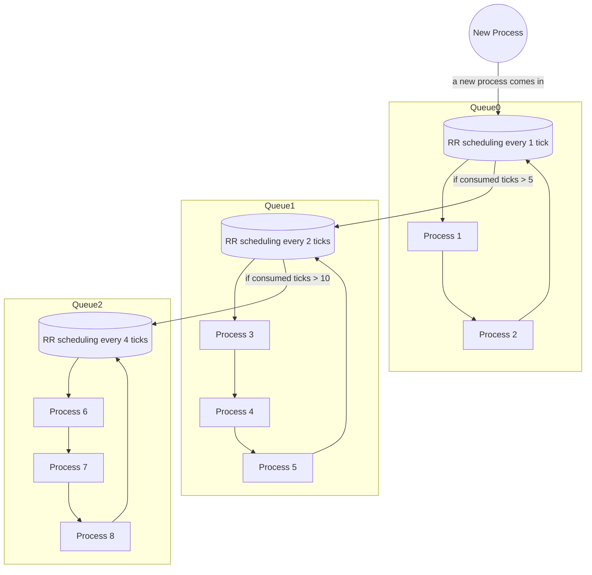

```mermaid
flowchart TB
    %% Queues
    Q0[(RR scheduling every 1 tick)]
    Q1[(RR scheduling every 2 ticks)]
    Q2[(RR scheduling every 4 ticks)]

    %% processes
    new_proc((New Process))
    proc1[Process 1]
    proc2[Process 2]
    proc3[Process 3]
    proc4[Process 4]
    proc5[Process 5]
    proc6[Process 6]
    proc7[Process 7]
    proc8[Process 8]
    subgraph Queue0
        direction LR
        Q0
        proc1
        proc2

        Q0 --> proc1
        proc1 --> proc2
        proc2 --> Q0
    end
    subgraph Queue1
        direction LR
        Q1
        proc3
        proc4
        proc5

        Q1 --> proc3
        proc3 --> proc4
        proc4 --> proc5
        proc5 --> Q1
    end
    subgraph Queue2
        direction LR
        Q2
        proc6
        proc7
        proc8

        Q2 --> proc6
        proc6 --> proc7
        proc7 --> proc8
        proc8 --> Q2
    end

    new_proc -- a new process comes in --> Q0
    Q0 -- if consumed ticks > 5 --> Q1
    Q1 -- if consumed ticks > 10 --> Q2
```