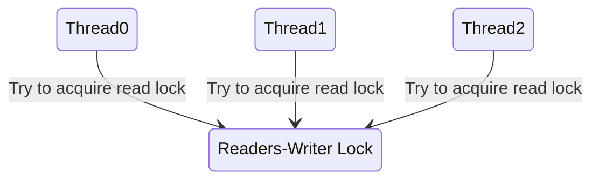
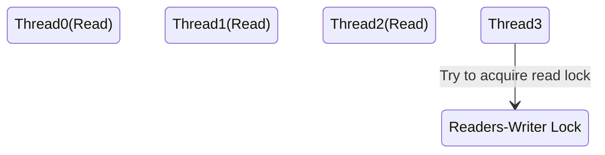
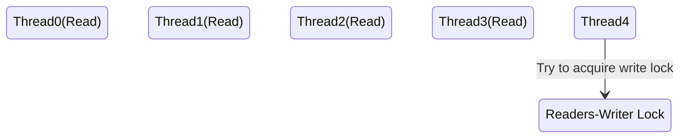
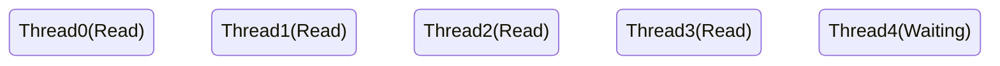
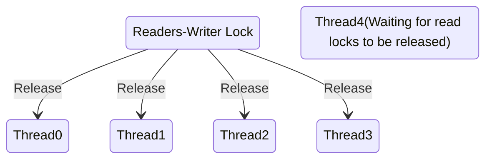
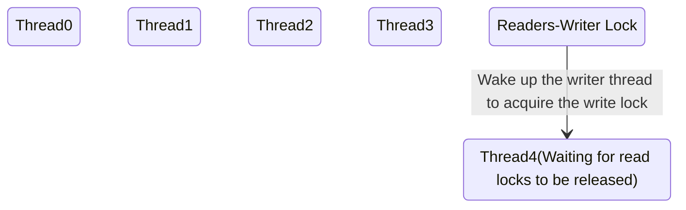
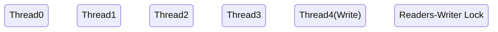

```mermaid
stateDiagram
    Thread0 --> RW : Try to acquire read lock
    Thread1 --> RW : Try to acquire read lock
    Thread2 --> RW : Try to acquire read lock
    RW : Readers-Writer Lock
```

```mermaid
stateDiagram
    Thread0 : Thread0(Read)
    Thread1 : Thread1(Read)
    Thread2 : Thread2(Read)
    Thread3 --> RW : Try to acquire read lock
    RW : Readers-Writer Lock
```

```mermaid
stateDiagram
    Thread0 : Thread0(Read)
    Thread1 : Thread1(Read)
    Thread2 : Thread2(Read)
    Thread3 : Thread3(Read)
    Thread4 --> RW : Try to acquire write lock
    RW : Readers-Writer Lock
```

```mermaid
stateDiagram
    Thread0 : Thread0(Read)
    Thread1 : Thread1(Read)
    Thread2 : Thread2(Read)
    Thread3 : Thread3(Read)
    Thread4 : Thread4(Waiting)
    %% RW : Readers-Writer Lock
```

```mermaid
stateDiagram
    RW --> Thread0 : Release
    RW --> Thread1 : Release
    RW --> Thread2 : Release
    RW --> Thread3 : Release
    Thread4 : Thread4(Waiting for read locks to be released)
    RW : Readers-Writer Lock
```

```mermaid
stateDiagram
    Thread0
    Thread1
    Thread2
    Thread3
    RW --> Thread4 : Wake up the writer thread to acquire the write lock
    Thread4 : Thread4(Waiting for read locks to be released)
    RW : Readers-Writer Lock
```

```mermaid
stateDiagram
    Thread0
    Thread1
    Thread2
    Thread3
    Thread4 : Thread4(Write)
    RW : Readers-Writer Lock
```