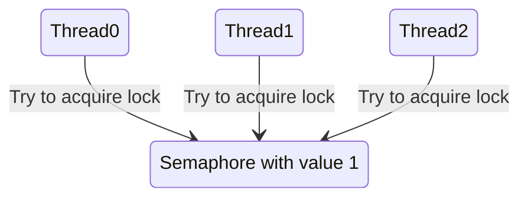
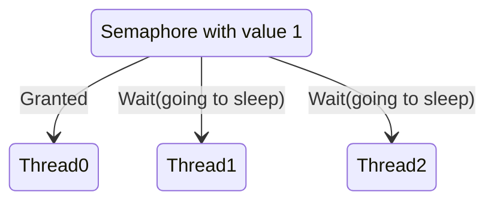
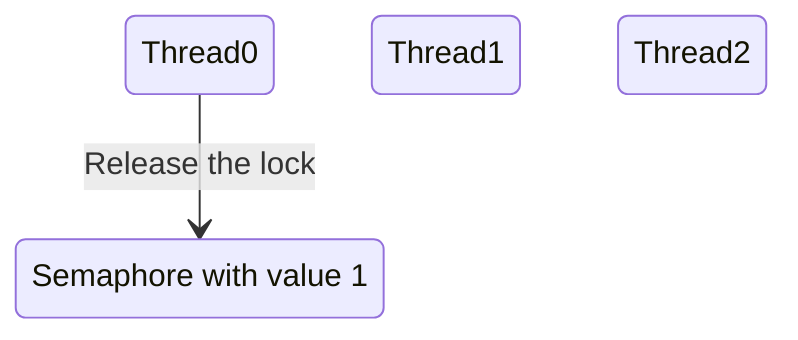
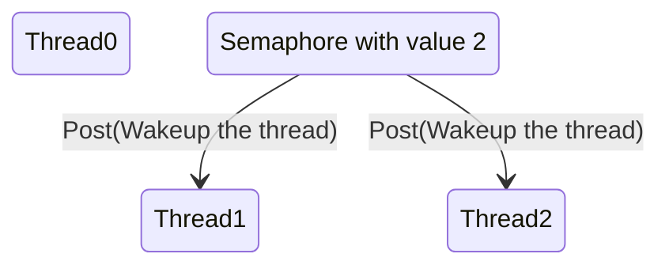
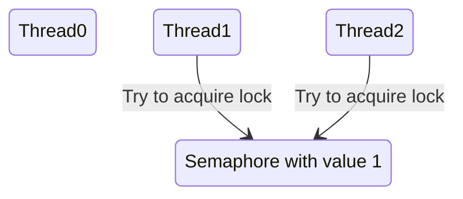
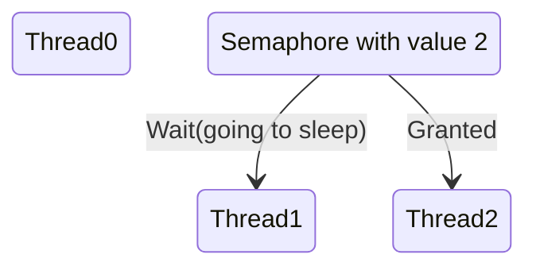

```mermaid
stateDiagram
    Thread0 --> Semaphore : Try to acquire lock
    Thread1 --> Semaphore : Try to acquire lock
    Thread2 --> Semaphore : Try to acquire lock
    Semaphore : Semaphore with value 1
```

```mermaid
stateDiagram
    Semaphore --> Thread0 : Granted
    Semaphore --> Thread1 : Wait(going to sleep)
    Semaphore --> Thread2 : Wait(going to sleep)
    Semaphore : Semaphore with value 1
```

```mermaid
stateDiagram
    Thread0 --> Semaphore : Release the lock
    Thread1
    Thread2
    Semaphore : Semaphore with value 1
```

```mermaid
stateDiagram
    Thread0
    Semaphore --> Thread1 : Post(Wakeup the thread)
    Semaphore --> Thread2 : Post(Wakeup the thread)
    Semaphore : Semaphore with value 2 
```

```mermaid
stateDiagram
    Thread0
    Thread1 --> Semaphore : Try to acquire lock
    Thread2 --> Semaphore : Try to acquire lock
    Semaphore : Semaphore with value 1
```

```mermaid
stateDiagram
    Thread0
    Semaphore --> Thread1 : Wait(going to sleep)
    Semaphore --> Thread2 : Granted
    Semaphore : Semaphore with value 2 
```